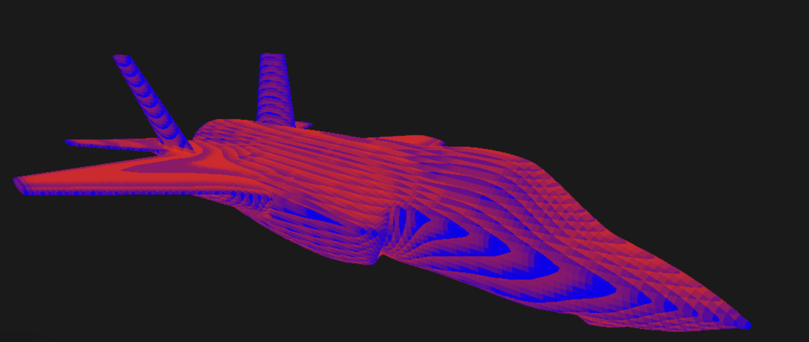
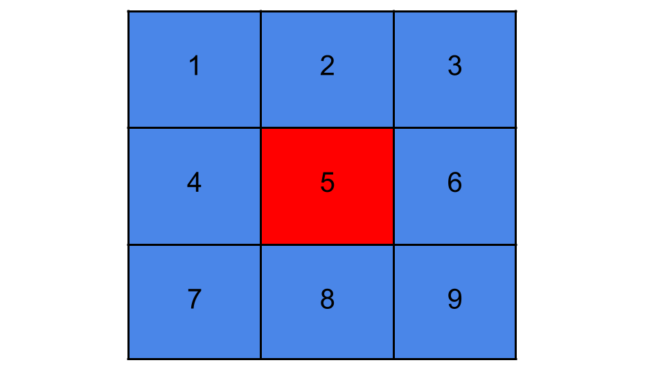
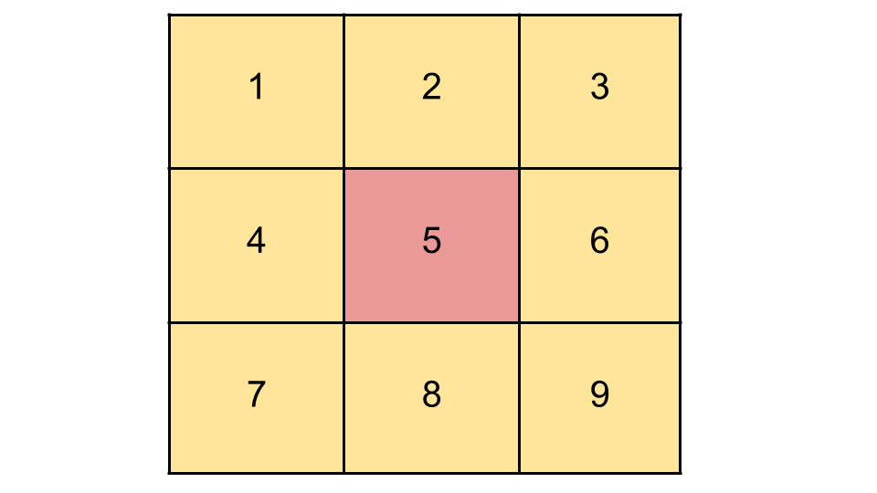

# FDM Based Heat Diffusion PDE Solver using WebGPU and React.js

## Live Demo - [Link](https://staging.dyt5pik1qsnne.amplifyapp.com/)
## Table of Contents
- [Project Overview](#project-overview)
- [Physics](#physics)
- [Hurdles](#hurdles)
- [How To use](#how-to-use)

## Project Overview
This project uses an approximation of the heat diffusion partial differential equation to calculate how objects change temperature. The first step is to create a discretized space by computing the boundaries needed based on the size of the 3D model. Next, break up the space into voxels of an appropriate size (lower voxel size will mean higher memory usage, but more accuracy). Then assign each voxel material properties based on if the object intersects with that voxel. If the 3D model intersects it gets the material properties of that object, otherwise it gets the ambient material properties. This is done once before the simulation is started and then those voxels are used to compute the change in temperature over time for each voxel. The temperatures are then drawn onto the surface of the 3D model as a color based heatmap.

## Physics

For specific math plase refer to this: [PDF](/Explanations/Heat%20Diffusion%20Approximation.pdf)

To explain the physics simply lets think about it in 2d space as a grid of squares:

The heat from the hot grid will always want to go to the colder grids: 

We can model this change exactly using the heat diffusion equation. 
Please refer to this pdf for more specific detail:  [PDF](/Explanations/Heat%20Diffusion%20Approximation.pdf)

## Hurdles

### There were two main hurdles in the making of this project

- [Combining WebGPU and React.js into an app](#combining-webgpu-and-react-js-into-an-app)
- [Rendering the Heatmap](#rendering-the-heatmap)

### Combining WebGPU and React js into an app

Because React.js has its own state management and it handles its own rerendering it's tricky to incorporate with webgpu. You can not let webgpu live in the react state or else you end up with react recreating device objects or your discretized spaces without you wanting it. Instead what I have done for this project is design all the webgpu (graphics and compute) functionality into regular JS files and then created a SceneManager class that acts as a wrapper over the gpu and exposes its methods to React.js in a global ref.

### Rendering the Heatmap

Because the surfaces of the 3D model do not necessarily lie exactly on any of the points that exist in the discretized space there are issues where when rendering the heatmap it accidentally samples from ambient points rather than points that hold the objects properties. As a workaround, for this setup instead of sampling directly from the point its closest to it computes the normal along the surface and then takes the temperature value one point closer to the inside of the object. If you look closely there are still some points along the edges of the surface that take the properties of the ambient points. More professional simulations create points that are paired directly along the surface of the object and map it directly instead of guessing. In a future iteration this will be the preferred approach.